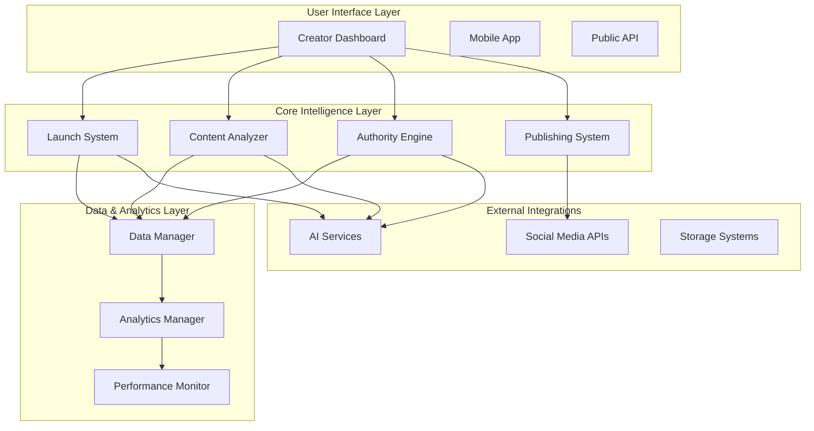

# Design Document: PodCast AI

## Overview

PodCast AI is a comprehensive AI-powered podcast intelligence platform designed to empower Indian podcast creators through intelligent planning, analysis, and content amplification. The platform transforms the podcast creation journey from initial concept to multi-platform authority building through three core capabilities: strategic launch planning, intelligent quality analysis, and automated content multiplication.

The system operates as an integrated ecosystem where each component enhances the others - launch insights inform content analysis, quality metrics guide content generation, and performance data refines future recommendations. This creates a continuous improvement cycle that helps creators build sustainable, high-quality podcast brands.

## Architecture

### System Architecture Overview

The platform follows a modular, service-oriented architecture with five primary components working in concert:

### End-to-End Platform Flow

**Creator Journey**: Creator Profile Setup → Launch System (Strategy Generation) → Episode Upload → Content Analyzer (PodScore & Analysis) → Authority Engine (Multi-Platform Content Generation) → Publishing System (Automated Scheduling) → Social Media Platforms → Analytics Dashboard (Performance Tracking)

This integrated flow ensures creators receive comprehensive support from initial podcast planning through content amplification and performance optimization.

### Component Responsibilities

**Launch System**: Provides strategic planning and setup guidance for new podcasts, generating comprehensive launch strategies tailored to Indian market dynamics and creator expertise.

**Content Analyzer**: Evaluates podcast episodes across multiple dimensions to generate PodScore metrics and actionable improvement recommendations.

**Authority Engine**: Transforms podcast episodes into optimized multi-platform content including clips, captions, hashtags, and visual assets.

**Publishing System**: Manages automated scheduling, distribution, and performance monitoring across social media platforms.

**Data Manager**: Centralizes all creator data, episode content, analytics, and user preferences while ensuring privacy and security.

## Components and Interfaces

### Launch System

The Launch System serves as the strategic foundation for new podcast creators, combining market intelligence with personalized guidance.

**Core Capabilities:**
- Strategic podcast planning based on creator expertise and market opportunities
- India-specific recommendations incorporating regional languages and cultural context
- Comprehensive launch checklists with timeline management
- Guest recommendation and interview preparation support
- Content calendar generation aligned with creator availability and audience preferences

**Key Interfaces:**
- Creator profile input and preference collection
- Market analysis and competitive landscape assessment
- Launch timeline and milestone tracking
- Integration with Content Analyzer for ongoing strategy refinement

### Content Analyzer

The Content Analyzer provides intelligent evaluation of podcast quality through multi-dimensional analysis, generating the proprietary PodScore metric.

**Analysis Dimensions:**
- **Question Quality Assessment**: Evaluates the depth, relevance, and engagement potential of interview questions and discussion topics
- **Domain Expertise Measurement**: Analyzes content depth, accuracy, and value delivery to assess creator authority
- **Presentation Quality Evaluation**: Examines voice clarity, energy levels, pacing, and overall delivery effectiveness
- **Engagement Moment Identification**: Identifies peak engagement segments and emotional resonance points

**Intelligence Flow:**
1. Episode ingestion and preprocessing for multi-language support
2. Parallel analysis across all quality dimensions
3. PodScore calculation with weighted scoring based on creator goals
4. Trend analysis and comparative performance assessment
5. Actionable recommendation generation for future episodes

### Authority Engine

The Authority Engine transforms podcast episodes into a comprehensive content ecosystem optimized for multi-platform distribution.

**Content Generation Pipeline:**
- **Clip Extraction**: Identifies and extracts the most engaging segments suitable for social media sharing
- **Platform Optimization**: Adapts content format, length, and style for specific platform requirements
- **Caption Generation**: Creates platform-specific captions that preserve creator voice and maximize engagement
- **Hashtag Intelligence**: Recommends trending and niche-specific hashtags based on content analysis and audience targeting
- **Visual Asset Creation**: Generates audiograms, quote cards, and branded thumbnails with consistent visual identity

**Multi-Language Processing:**
The engine maintains cultural context and linguistic nuances across all supported Indian languages, ensuring authentic regional market engagement.

### Publishing System

The Publishing System orchestrates automated content distribution while maintaining quality control and creator oversight.

**Distribution Management:**
- Intelligent scheduling based on audience engagement patterns and platform algorithms
- Strategic content distribution to avoid oversaturation while maintaining consistent presence
- Platform-specific formatting and optimization compliance
- Performance monitoring and strategy adjustment based on engagement metrics

**Creator Control Features:**
- Preview and approval workflows for quality assurance
- Customizable automation levels from full automation to manual approval
- Real-time posting status and failure recovery mechanisms
- Performance-based scheduling optimization

## Data Models

### Creator Profile Model

The Creator Profile serves as the central intelligence hub, storing comprehensive information about each creator's goals, preferences, and performance history.

**Profile Components:**
- **Identity Information**: Basic creator details, expertise areas, and target audience demographics
- **Content Preferences**: Preferred languages, content style, tone, and platform priorities
- **Brand Guidelines**: Visual identity standards, messaging frameworks, and quality requirements
- **Performance History**: Historical PodScore trends, engagement patterns, and improvement trajectories
- **Social Media Integration**: Connected platform accounts, posting preferences, and audience insights

### Episode Data Model

Episodes represent the core content units processed by the platform, containing both raw content and derived intelligence.

**Episode Structure:**
- **Content Metadata**: Title, description, duration, language, and topic categorization
- **Quality Metrics**: PodScore components, analysis results, and improvement recommendations
- **Generated Assets**: Extracted clips, captions, hashtags, and visual content variations
- **Performance Data**: Cross-platform engagement metrics, reach statistics, and audience feedback
- **Processing Status**: Analysis completion, content generation progress, and publishing status

### Content Asset Model

Content Assets represent the various forms of content generated from podcast episodes for multi-platform distribution.

**Asset Categories:**
- **Audio Clips**: Extracted segments with platform-specific duration and format optimization
- **Visual Content**: Audiograms, quote cards, thumbnails, and branded graphics
- **Text Content**: Captions, hashtags, social media posts, and thread content
- **Scheduling Data**: Optimal posting times, platform targeting, and performance predictions

## AI Intelligence Flow

### Content Processing Pipeline

The platform's AI intelligence operates through a sophisticated multi-stage pipeline that transforms raw podcast content into actionable insights and optimized content assets.

**Stage 1: Content Ingestion and Preprocessing**
- Multi-language audio transcription with cultural context preservation
- Speaker identification and dialogue segmentation
- Topic extraction and content categorization
- Language detection and regional dialect recognition

**Stage 2: Quality Analysis and Scoring**
- Parallel analysis across all PodScore dimensions using specialized AI models
- Cross-referencing with creator goals and audience preferences
- Comparative analysis against creator's historical performance and industry benchmarks
- Trend identification and pattern recognition for improvement recommendations

**Stage 3: Content Intelligence Generation**
- Engagement moment identification using audio analysis and transcript processing
- Key quote extraction and viral potential assessment
- Topic relevance scoring for different social media platforms
- Audience interest prediction based on content themes and creator history

**Stage 4: Multi-Platform Content Creation**
- Platform-specific content adaptation using format and audience optimization
- Brand consistency enforcement across all generated assets
- Cultural and linguistic adaptation for regional market targeting
- Performance prediction modeling for content scheduling optimization

### Learning and Adaptation

The platform continuously improves through feedback loops and performance analysis:

**Creator Feedback Integration**: User approvals, rejections, and modifications inform future content generation accuracy
**Performance Learning**: Engagement metrics and audience response data refine recommendation algorithms
**Market Intelligence**: Trending topics, hashtag performance, and platform algorithm changes update optimization strategies
**Cultural Adaptation**: Regional engagement patterns and language preferences enhance localization accuracy

## Error Handling

### Content Processing Resilience

**Audio Quality Management**: The system handles varying audio quality levels gracefully, providing quality improvement suggestions while maintaining analysis accuracy.

**Language Processing Fallbacks**: When regional language processing encounters challenges, the system provides fallback analysis in English while flagging areas for manual review.

### Publishing and User Experience

**Posting Failure Recovery**: Social media API failures trigger automatic retry mechanisms, while providing alternative posting options and creator notifications.

**User Notifications**: Clear error messages and recovery options ensure creators stay informed about any issues with content processing or publishing.

**Graceful Degradation**: When services experience temporary issues, the platform maintains core functionality through cached recommendations and manual override options.

## Scalability Considerations

### Architecture Design

**Modular Components**: Each major component (Launch System, Content Analyzer, Authority Engine, Publishing System) operates independently, enabling targeted scaling based on usage patterns.

**Horizontal Scaling**: AI-intensive operations can be distributed across multiple processing units to handle varying episode lengths and user loads.

**Data Management**: Scalable storage systems with intelligent data organization to manage growing creator bases and content libraries.

### Performance Optimization

**Caching Strategy**: Frequently accessed creator data, generated content, and analysis results are cached to improve response times.

**Batch Processing**: Non-urgent operations like trend analysis and performance reporting run during off-peak hours to optimize resource usage.

**Load Balancing**: Automatic distribution of processing workload to maintain consistent user experience during peak usage.

## Privacy and Security

### Data Protection Framework

**Creator Data Privacy**: Comprehensive data protection ensuring creator content, personal information, and performance metrics remain secure and are used only for platform functionality.

**Content Security**: End-to-end encryption for podcast content during processing, storage, and transmission to protect intellectual property and sensitive discussions.

**Social Media Integration Security**: Secure OAuth implementations with minimal permission requests and clear explanations of data usage for social media platform integrations.

### Compliance and Governance

**Regional Compliance**: Adherence to Indian data protection regulations and international privacy standards for creators operating across different markets.

**Transparent Data Usage**: Clear documentation of how creator data is used for AI training and platform improvement, with opt-out mechanisms for sensitive use cases.

**Content Ownership**: Explicit creator ownership of all original content and generated assets, with platform usage rights limited to service provision only.

## Responsible AI

### Ethical Content Generation

**Cultural Sensitivity**: AI models are designed with awareness of Indian cultural contexts, regional sensitivities, and appropriate content standards across different communities.

**Bias Mitigation**: The platform actively works to ensure fair treatment across different creator backgrounds, languages, and content types through careful model design and validation.

**Content Authenticity**: Generated content is clearly labeled as AI-assisted while preserving creator voice and authenticity in all materials.

### Creator Control and Transparency

**Algorithm Transparency**: Clear explanations of how PodScore calculations work and what factors influence content generation recommendations.

**Creator Agency**: Comprehensive control mechanisms allow creators to adjust AI behavior, approve content before publication, and maintain final editorial control over their brand.

**Quality Standards**: Automated quality checks ensure generated content meets standards for grammar, clarity, accessibility, and professional presentation while incorporating creator feedback for continuous improvement.